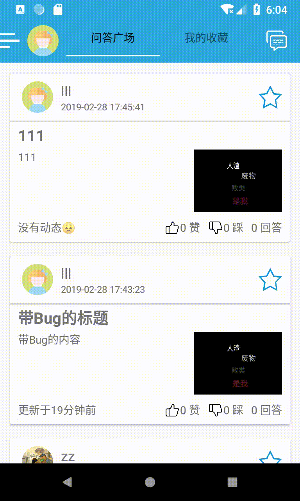
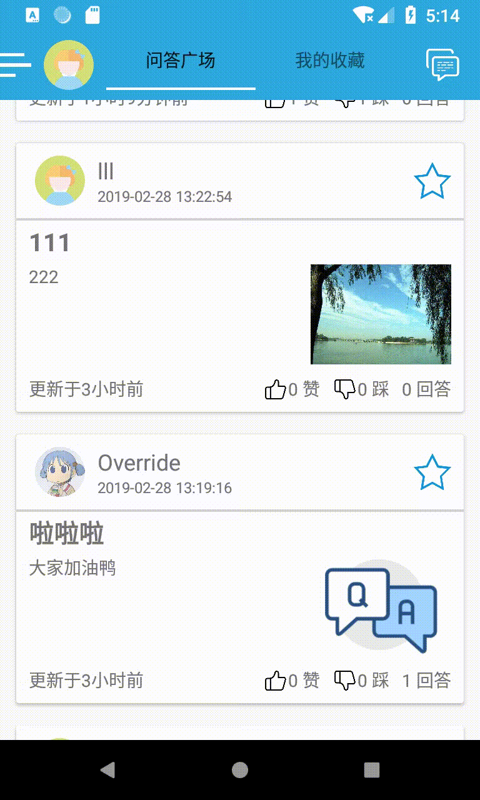
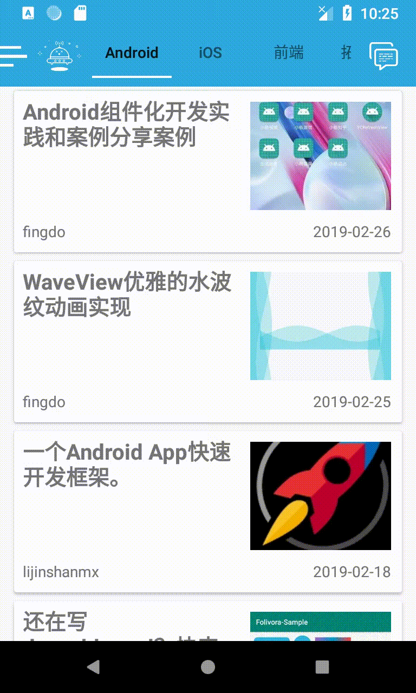
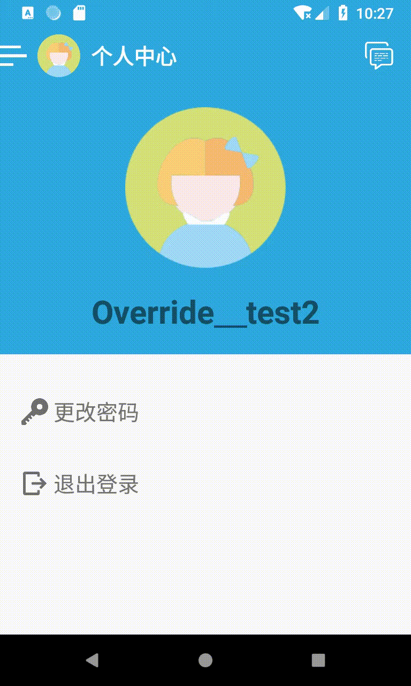

### 红岩网校移动开发部Android寒假考核作业-黄龙-2018214137
#### 一、功能简述(多图预警！！！本来想挂七牛的然后发现七牛30d之后就没了😭)
1. 获得最新的Gank资讯📰

| Gank资讯主页面 | Gank资讯点击及复制URL |
| ------------- | ----           |
|  |  |

2. 获得最新的Gank闲读📖api真的很慢。。。。。。

  

3. [Bi乎](https://github.com/jay68/bihu_web/wiki/%E9%80%BC%E4%B9%8EAPI%E6%96%87%E6%A1%A3)api的完整解决方案😆

  | 使用默认账号进入问答广场                                     | 登录                                                     | 赞、踩、收藏（离线更新）                                    |
  | ------------------------------------------------------------ | -------------------------------------------------------- | ----------------------------------------------------------- |
  |  |  |  |

  | 发布问题(带图片）                                           | 问题详情界面                                                 | 回答问题（带图片）                                        |
  | ----------------------------------------------------------- | ------------------------------------------------------------ | --------------------------------------------------------- |
  |  |  |  |

  |      无网络状态| 恢复网络     |   更换头像   |
  | ---- | ---- | ---- |
  |      |       |      |

  
#### 二、性能优化👾
1. 使用通过将图片保存在本地来缓存图像
2. 在无网络连接或者网络连接超时时会使用先前缓存的数据
#### 三、使用的第三方包👇
1. [七牛](https://developer.qiniu.com/kodo/sdk/1236/android)

#### 四、What ‘s new?🧐
1. 封装了很多方法，一部分放在developtools包内，另一部分在bihu包里，不知道算不算封装工具类📦，主要包括：
* 网络请求类-HttpsRequestHelper(GET&POST)  
* 图片加载、处理类-MyImageTools(包含：从网络获取图片，从本地获取图片，保存图片到本地，int类型的资源地址转换成Bitmap，将Bitmap切成圆形)。
* 实现Bihu所有api的BihuPostTools在bihu包里，还有离线时的处理方法。
2. 在没有登陆自己的bihu时默认使用游客账号登陆并可以查看问答，触发相关需要登陆用户自己账号的事件的时候会弹出login界面，登陆成功后正常使用(整个应用程序网络请求使用唯一用户(User)：BihuFragment.nowUser)
3. 在无网络连接(非连接超时)时进入离线模式，用户id替换成id+(离线)，头像更换为无网络连接的头像，所有数据为缓存数据，Bihu相关功能被禁用，在个人中心点击头像登陆后若网络恢复即可继续正常使用。(捕获UnknownHostException 并处理)
4. 在网络连接超时时自动加载缓存的数据(捕获TimeoutException 并处理)
5. 所有数据加载的时候模式都为：获取到json后优先加载文字数据，有图片的先使用占位图代替，然后再开线程加载图片，加载完成后及时更新(在ViewHolder中开线程然后在使用提前获取到的mainHandler(构造adapter时就已经把Activity的Handler传进来)来更新ui)
6. 整个应用程序加载图片时使用唯一方法MyImageTools.getBitmap(String url),该方法封装了从url获得图片和从本地获得图片
7. 在Bihu发布问题，回答问题时可以选择多张图片,问题详情页面可以正常显示全部图片(LinearLayout.addView)
8. 由于ganknew和闲读有些资讯、Bihu有些问题没有图片，使用对应的占位图来代替
9. 图片加载，RecyclerView首次加载时会有淡入动画，但recyclerview里的图片由于机制问题会在第一次之后依然有淡入动画
10. 一些较为人性化的优化设计，比如activity之间的跳转，注册成功后会自动跳过登录界面直接登录等

#### 五、已知BUG
1. 部分机型无法从相册获得照片的uri

#### 五、感受体会
##### 1.学习了很多新的东西，在做考核前我甚至不知道怎么post请求……

* POST请求
* 利用接口回调给RecyclerView和RecyclerView中的一个控件添加点击事件
* 将handler传入RecyclerView从而进行实时UI更新。
* LinearLayout的一般使用，减少对约束布局的使用
* 自定义动画anim的超简单实用(透明度的更改Alpha)
* 打包有签名的apk
* log的疯狂使用
* ……省略无数个坑，在代码中都有相对应的注释

##### 2. 真的很累，一是因为要补考所以寒假结束前一周没得做，二也是最重要的是因为自己懒了，压到ddl再做。这几天一直在熬夜肝已经连续5天肝到3点了，仔细回想来学校前不过是做了gank和闲读的adapter，界面和bihu的问题列表，登陆也没写，一直都是默默在后台登录，大部分工作是来了学校补考完再和sajo玩了两天之后，也就是这5天做的。虽然明显是自找的，但是我第一次写代码写到吐了……
##### 3.自己知道的不足之处还有很多，但是我最近想休息一下了，学长学姐们或者同学们记得提意见给我发issue嗷☺️☺️☺️
* 没有设计预加载
* 没有欢迎界面
* 闲读的api真的非常非常非常之慢，我尽力了
* 代码其实不规范，很多无用或者过于复杂的设计
* 做得太慢了
